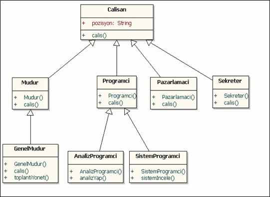

# Dart Learn 101

[[TOC]]


## Print
```dart
  print('tırnak\'lar ayrıldığında');
  print(8*4);
  print("fatih""emre");
  print("fatih"+"emre");
  //tırnak'lar ayrıldığında
  //32
  //fatihemre
  //fatihemre
```

## Variable 
- number, double, int  
- String
- boolen
- List (Array)
- Maps
- Runes (string karakterdeki unicode)
- Symbols
- Var (değerin durumuna göre kendi tanımlama yapar)
> Not: Tüm değişkenler object kabul edilir boş kalan tüm değerler "null" değeri alır. Kullanırken dikkat edilmelidir.

### String
```dart
String name= "fatih";
String lastName= "emre";
print(name +" "+ lastName);
print("İsim: $name $lastName");
print("Karakter : ${name.length}");
//fatih emre
//İsim: fatih emre
//Karakter : 5

int yas = 30;
print("yaş $yas yolun yarısı eder.");
print("yaş "+ yas.toString()+ " yolun yarısı eder.");
//yaş 30 yolun yarısı eder.
//yaş 30 yolun yarısı eder.
int x=10, y=3;
print("sayıların çarpımı: ${x*y}");
//sayıların çarpımı: 30

//Print: String başladığı için her şey string olması gerekir .toString();
```

### Final Const Degismez Deger
> **Final**: Kullanılmadıkça bellekte yer tutmaz. Türü isteğe bağlı<br> **Const**: Her daim yer tutar. **İnstance ise:** *****static const***** olarak kullanılır.

## if else

> && : **VE**<br><br>&nbsp;||&nbsp;&nbsp;&nbsp; :**VEYA**<br><br>&nbsp;&nbsp;!&nbsp;&nbsp;&nbsp; : **DEĞİL**

### Ternary Soru isareti kosulu

```dart
var x=10,y=30, z;
z= (x>y) ? "dogru" : "yanlış" ;
//yanlış
```

#### Null degeri kontrol etme kosulu
> İlk dolu olan içeriği değişkene atıyor.
```dart
var x,y="dolu değer", z;

z= x ?? y;
//dolu değer
```

## Switch
>Belli bir aralıktan oluşan koşullar için kullanışlı olabilir.
```dart
switch (degişken) {
  case "deger":
    //add ...
    break;
    case "deger":
    //add ...
    break;
  default:
    //add ...
}
```

## Döngüler For While DoWhile

### For
```dart
for (var i = 0; i < 10; i++) {
  print(i);
}

List isimler = ["fatih","emre","kalem"];
for (var name in isimler) {
  print(name);
}
```

### While

```dart
while (koşul) {
  // ...
}

// döngüden sonra kontrol eder.
do {
  //...
} while (koşul);
```

### Break Continue

```dart
for (var i = 0; i < 10; i++) {
  
  if (i>5) {
  print("i değeri: $i");  
  } else {
  print("Döngünün başına atladı: $i");
    continue;
  //altına yazılanları çalıştırmaz...
  }
}
//Döngünün başına atladı: 0
//Döngünün başına atladı: 1
//Döngünün başına atladı: 2
//Döngünün başına atladı: 3
//Döngünün başına atladı: 4
//Döngünün başına atladı: 5
//i değeri: 6
//i değeri: 7
//i değeri: 8
//i değeri: 9
```
----------
```dart

for (var i = 0; i < 10; i++) {
  
  if (i<5) {
  print("i değeri: $i");  
  } else {
  print("Durdu: $i");
  //Denk gelirse durur.
    break;
  
  }
}
//i değeri: 0
//i değeri: 1
//i değeri: 2
//i değeri: 3
//i değeri: 4
//Durdu: 5
```

## Fonksiyonlar

```dart
main(List<String> args) {
print(carp(5,10));  
}
int carp (int bir , int iki)
{
  return bir*iki;
}
//50
```

### Fat Arrow
> => değeriyle kullanılarak açılır. <br> **Asla süslü parantez almaz. Tek satır yazılır.**

```dart
main(List<String> args) {
print("Toplam: "+ topla(5,20).toString());  
}

int topla (int bir , int iki)=> bir+iki;
//25
```

### Opsiyonel ve isimlendirilmis parametreler
> Fonksiyona alınan parametrelerin ecma script benzer özellikle bir esnekliğe hakim. Boş girilen parametreler **"NULL"** degeri döndürür.<br> 
>- **"[int x ,string y]"** köşeli parentez <br>parantez içerisinde yer alan değer girilmesede fonksiyon çalışır.<br><br> 
>- **"{int x ,string y}"** süslü parantez <br>  parantez içerisinde yer alan parametrelerin sırası önemli olmamak kaydıyla değer kabul eder: **(parametre:value)** <br> <br>
>- **(int x=5,string="name")** koşula göre atanan değer

#### koseli parantez
```dart
main(List<String> args) {
deger(50); 
}
void deger (int sayi, [String  name,bool bayrak])
{
print("$sayi  $name  $bayrak");
}
//50  null  null
//50  fatih  null
```

#### suslu parantez
```dart
main(List<String> args) {
deger(50,name:"fatih",bayrak:false); 
}
void deger (int sayi, {String  name,bool bayrak})
{
print("$sayi  $name  $bayrak");
}
//50  fatih  false
```

#### Null degere karsilik deger atama
```dart
main(List<String> args) {
deger(50); 
}
void deger (int sayi, [String  name="emre",bool bayrak])
{
print("$sayi  $name  $bayrak");
}
//50  emre  null
//Koşul ataması için köşeli ya da süslü par. içinde olmalı.
```

## exception try catch finalyy tilda

 >İlerleyen zamanlarda kendi hata mesajları oluşturabilirsin.
 
> **try:** hata vermesi olası olan yapılarda kullanılır.<br>
**catch:** hata durumunda çalışan kısım genelde hata mesajı döndürülür.<br>
**finally:** hata olsun olmasın her daim çalışan kod bloğu.<br>
**tilda (~):** bazı hataları geçici bir şekilde engeller. <br>
**catch(e,stash):**<br> e: normal hatayı. <br>stash: detaylı hata sıra dizisini gösterir.
```dart
try {
  int sonuc= 12~/0;
  print(sonuc);
} catch (e,stash) {
  print("Hata: $e  $stash");
}
//Hata: IntegerDivisionByZeroException  #0   //   int.~/  (dart:core-patch///integers.dart:24:7)
//#1      main 
//variable.dart:5
//#2      _startIsolate.<anonymous closure>  //(dart:isolate-patch///isolate_patch.dart:305:32)
//#3      _RawReceivePortImpl._handleMessage // (dart:isolate-patch///isolate_patch.dart:174:12)
```

```dart
try {
  int sonuc= 12~/0;
  print(sonuc);
} catch (e,stash) {
  print("Hata: $e : $stash");
}
finally{
  print("her zaman çalışır");
}
//Hata: IntegerDivisionByZeroException : #0  //    int.~/  (dart:core-patch///integers.dart:24:7)
//#1      main 
//variable.dart:5
//#2      _startIsolate.<anonymous closure>  //(dart:isolate-patch///isolate_patch.dart:305:32)
//#3      _RawReceivePortImpl._handleMessage // (dart:isolate-patch///isolate_patch.dart:174:12)

//her zaman çalışır --FİNALLY
```

## Array Listler

> Arraylar iki türe ayrılır <br>
Sabit listeler ve Büyüyen listeler.
Büyüyen listeler veri eklemek sabit listelere göre biraz farklıdır. Verileri tanımlayabilmemiz için bazı methodlar kullanmamız gerekiyor bunlar.
>- **clear** : ne var ne yok temizler.
>- **remove**: verilen elamanı siler.
>- **removeAt** : belirtilen index verisini siler. <br>
>örneklerle bunları çoğaltabiliriz...

```dart
//Listlerin türleri belirtilerek oluşturulur.
List<int> sayilarSabit= List(5);
List<int> sayilarDinamik= List();
for (var sayi in sayilarSabit) {
  print(sayi);
}
//lambda
sayilarDinamik.forEach( (sayi)=> print(sayi) );

List <String> sehir = ["Denizli","Aydın","Muğla"];
sehir.add("Adana");
sehir.add("Ankara");
for (var il in sehir) {
  print(il);
}
//Denizli
//Aydın
//Muğla
//Adana
//Ankara
```

### Set yapisi

>List en önemli farkı birden çok aynı veriyi bir kere alması ve düzensiz sıralama yapması index yapısı olmadığı için. <br> Verilerin kontrolünü **contains** ile sağlanıyor.

```dart
Set<String> isim = Set();
isim.add("fatih");
isim.add("fatih");
isim.add("emre");
isim.add("emre");

isim.forEach((name)=>print(name));
//Listlerin bu türleri true false döndürebilir.
if(isim.contains("emre"))
print("vardır");
//fatih
//emre
//vardır
Set<int> numara= Set.from([1,2,3,4]);
print(numara);
//{1, 2, 3, 4}

//addAll herhangi liste içeriğini başka listeye eklemesini sağlar.
Set<int> rakam= Set();
rakam.addAll(numara);
print(rakam);
```

### map yapisi

> Yapı olarak set dizisiyle çok benzer yanları vardır. Fakat map ayıran özellik ise değerleri <br> **key:value**<br>olarak tutmasından geliyor. burası objede olabilir .json gibide düşünülebilir.

```dart
Map<String,Object>  kisi = Map();
kisi["ad"]="fatih";
kisi["yas"]=25;
kisi["erkemi"]=false;
for (var deger in kisi.values) {
  print(deger);
}
//fatih
//25
//false
for (var keys in kisi.keys)
print(keys);
//ad
//yas
//erkemi

// güncelleme nasıl yapılır.
kisi.update("ad",(value)=>"hasan");
print(kisi["ad"]);
//Hasan
```


## Siniflar ve Nesne Kavramlari
>Sınıflar ve nesneler(İnstance) kullanım alanları genelde belirlenen yapıların sürekli tekrarlarından kurtarmak için kullanılır bu gibi yapıların içlerine sadece değişken taşımamakla birlikte fonksiyonlarıda barındırabilir yani eylemleride içlerinde barındırır.

```dart
main(List<String> args) {
Ogrenci ybs = Ogrenci();
ybs.ad="fatih";
ybs.vizeNot=85;
ybs.finalNot=15;
ybs.gectiMi=false;
ybs.durum();
print(ybs.ortalama());
ybs.ikinciDurum();

}
class Ogrenci {
  String ad;
  int vizeNot;
  int finalNot;
  bool gectiMi;

  double ortalama() => (this.vizeNot*0.4)+(this.finalNot*0.6);

  void durum(){ 
    print("Ad: $ad Ort: ${this.ortalama()}   Durum: $gectiMi");
  }
 void ikinciDurum()
  {print("Name: ${this.ad}");}
}
//Ad: fatih Ort: 43.0   Durum: false
//43.0
//ybs.ikinciDurum();
//Name: fatih
```

### Consructor Kurucu methodlar

>classın barındırdığı değişkenlere dışardan daha düzenli bir veri gönderilmesini sağlar.

```dart

class Ogrenci {
  String ad;
  int vizeNot;
  int finalNot;
  bool gectiMi;

  Ogrenci(this.ad,this.vizeNot,this.finalNot,this.gectiMi)
 {
   //Pratik tanımalamak için kullanılır.
 }
 //mainde ise bu şekilde atama yapılır.
 Ogrenci ybs = Ogrenci("fatih",50,50,true);
```

### getter setter private deger
>bu türler class tanımlamalarımızı çıkabilecek hatalara ve tehlikelere önlem almamıza yarıyor.<br>
**gettter**: bu deger instance istenilen degerleri kontrollü şekilde döndürmesini sağlar.<br>
**setter**: instance dışardan gelen değerlere karşı hata oluşturmasına karşı önlem alınması için kullanılır.

```dart
Ogrenci ybs = Ogrenci("fatih",50,50,true);
ybs.vizeGuncelle(-50);
print(ybs.vizeNot);
void set vizeGuncelle (int not)
 {
  this.vizeNot = (not<0) ? 1 : not;
 }
 //1
```
```dart
//85,15
print(ybs.ortalama);
double get ortalama => (this.vizeNot*0.4)+(this.finalNot*0.6);
//30.4
```
#### private deger

> classlara tanımalanan değişkenlerin dışardan ulaşılmasını engellemel amaçlı kullanılır.

```dart
int ad;

int _soyad; // bu şekilde kullanılan değişkenler dışarıdan ulaşılamazlar.
```
##  Kalıtım ve Poliforfizm nedir

>Kalıtım yapısı mantığı biyoloji tanımıyla birebir uyuşmaktadır. Tercih edilen kullanım  yöntemi ise daha çok bir birlerine benziyen instance yapılarının ortak özelliğini bir araya toplayan bir sınıf oluşturulur ve kullanılmak istenen instance nesnelerine bağlanır **"extend"** yapısıyla bağlanır. Poliforfizm ise bu kelime anlamında çok çeşitlilik anlamını taşıdığından bu kalıtım özelliklerini nasıl kullanıldığını ele alır.



```dart
main(List<String> args) {
 var karabas=Kopek();
 karabas.sesler();
 //yemek ye metodu Hayvan Class miras aldı.
 karabas.yemekYe();

}
class Hayvan {
  void yemekYe(){
    print("yemek yiyor");
  }
}
class Kopek extends Hayvan {
   void sesler(){
    print("hav hav");
  }
```
### Method Override

> Overriding kullanılan yerlerde üst sınıftan methods almış demektir fakat burdaki yöntem ise aynı isme sahip fonksiyonda class içerisinde kendimize göre yapılandırabilmemizi sağlarız. <br
> **super** adında bir anahtar kelimemiz var bu ise üst sınıftaki methodu tekrar çalıştırmamıza yarıyor.<br> Miras alınan sınıfın methodlarının üzerine yazmak olarak bilinir.


```dart
//main class
var tekir = Kedi();
tekir.yemekYe();
class Hayvan {
  void yemekYe(){
    print("yemek yiyor");
  }
}
class Kedi extends Hayvan{
  void sesler(){
    print("meow");
  }

  @override
  void yemekYe() {
    print("kedi besin alıyor");
    //super anahtar kelimesi silinirse sadece fonksiyon içerisindekiler derlenir.
    super.yemekYe();
  }
}
//kedi besin alıyor
//yemek yiyor

//super silinirse beklenen çıktı:
//kedi besin alıyor
```

### Late Binding gec baglama

> Bu kavramları daha iyi tanıyabilmemiz için nesneye yönelik proğ. nasıl çalıştığı bilmemiz lazım nesneye yönelik proğ. object oriented bir dil özelliği taşır yani kısaca kodlar derlenene kadar kodda yazılanları kimse bilmez bu sebebi ise object içinde her şeyi tutabilmesinden kaynaklıdır. Daha kalite kod yazabilmemiz açısından binding kavramları gelişmiştir iki türü vardır erken ve geç bağlama bunları bir adres gibi düşünebliriz derleyici derlenemeden önce neyi derleyeceğini bildiğinden bu bize hız kazandırır. 

```dart
class Hayvan {
  void yemekYe(){
    print("yemek yiyor");
  }
  void yemekYe(){
    print("yemek yiyor");
  }
}
void canli(Hayvan alive) {
alive.yemekYe();
alive.uyuyor();
}
class Kedi extends Hayvan{
  void sesler(){
    print("meow");
  }
  @override
  void yemekYe() {
    print("kedi besin alıyor");
    
  }
}
// kedi besin alıyor
// Dinleniyor
```

